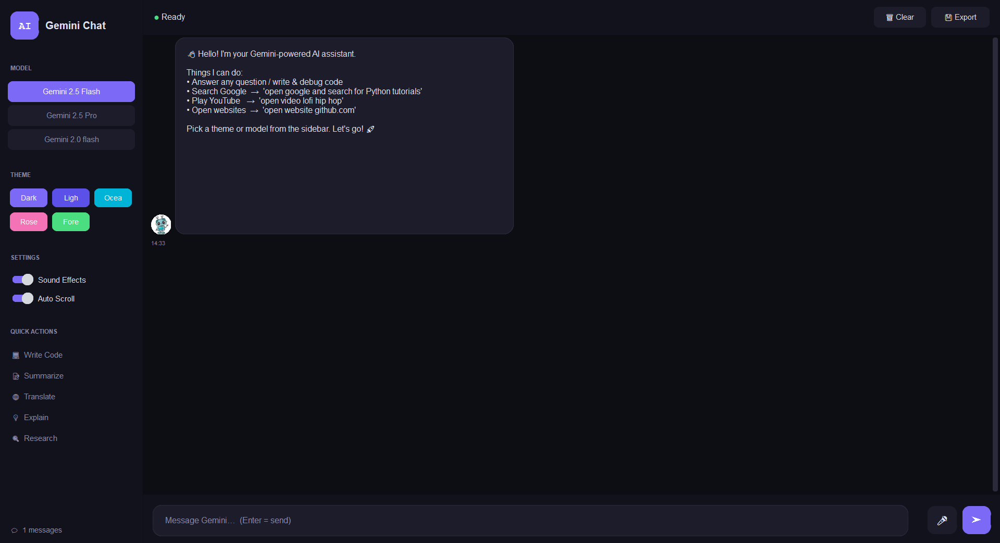

# AI Chatbot Pro 🤖

A modern AI-powered desktop chatbot built with Python, CustomTkinter, and Google's Gemini AI.

## Features

### AI Chat

* Powered by Google Gemini
* Multiple model support

  * Gemini 2.5 Flash
  * Gemini 2.5 Pro
  * Gemini 2.0 Flash

### Voice Features

* Speech-to-text input
* Text-to-speech responses
* Hands-free interaction

### Modern UI

* Dark Theme
* Light Theme
* Ocean Theme
* Rose Theme
* Forest Theme

### Quick Actions

* Code Generation
* Summarization
* Translation
* Explanation
* Research Assistance

### Smart Tools

* Google Search Integration
* YouTube Search
* Video Playback
* Website Launcher

### Productivity Features

* Export Chat History
* Auto Scroll
* Message Statistics
* Model Switching
* Animated Thinking Indicator

## Technologies Used

* Python
* Google Gemini API
* CustomTkinter
* SpeechRecognition
* Pyttsx3
* Pillow
* PyWhatKit
* Python Dotenv

## Installation

Clone the repository:

```bash
git clone https://github.com/yourusername/ai-chatbot-pro.git
cd ai-chatbot-pro
```

Install dependencies:

```bash
pip install -r requirements.txt
```

Create a `.env` file:

```env
GOOGLE_API_KEY=your_api_key_here
```

Run the application:

```bash
python app.py
```

## Screenshots

Add screenshots of the application here.

## Project Structure

```text
AI_CHATBOT/
│
├── images/
│   ├── bot.jpg
│   ├── user.jpg
│   └── robo.gif
│
├── app.py
├── requirements.txt
├── .env
├── .gitignore
└── README.md
```
## Project Screen Shots


## Future Improvements

* Chat history persistence
* Markdown rendering
* Streaming AI responses
* File uploads
* PDF analysis
* Web version deployment

## Author

Aman

Computer Science Engineering (AI & Data Science)

Government Hydro Engineering College
